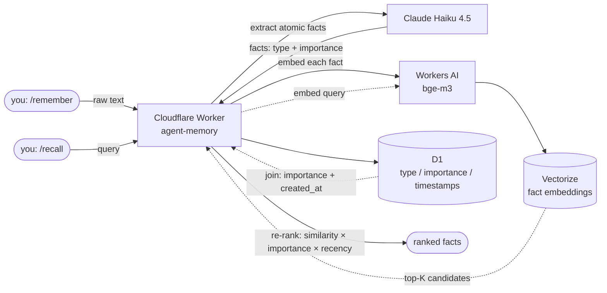

# 🧠 agent-memory

A small, self-hosted long-term memory layer for AI agents — mem0 / Supermemory style — built entirely on Cloudflare's free tier plus Claude Haiku 4.5.

**[Live Demo →](https://evgeniimatveev.github.io/agent-memory/)**


**API base:** `https://evgeniimatveev-agent-memory.evgeniimatveevusa.workers.dev`

## What it does

Most RAG demos embed-and-search a fixed corpus. This is different: it's a *write path* for memory. You feed it raw text (a conversation turn, a note, anything), and it:

1. **Extracts** discrete, atomic, memorable facts from the text (Claude Haiku 4.5) — not the whole blob, just what's actually worth remembering, typed as `preference | fact | event | correction` with an importance score (1–5).
2. **Embeds** each fact (`@cf/baai/bge-m3`, 1024-dim) and stores it in **Vectorize** for semantic search, plus a structured row in **D1** (type, importance, timestamps).
3. On recall, **re-ranks** candidates by `similarity × importance × recency-decay` — not raw cosine similarity alone. A highly-relevant but week-old trivial fact loses to a slightly-less-relevant but important, fresh one.

## Architecture



`/remember` is the write path (top), `/recall` is the read path (bottom) — both share the same Worker, embedding model, Vectorize index and D1 table; nothing is duplicated per-endpoint.

| Component | Role |
|---|---|
| Cloudflare Vectorize | semantic search over fact embeddings (1024-dim, cosine) |
| Cloudflare D1 | structured fact metadata — type, importance, timestamps |
| Workers AI (`bge-m3`) | embeddings |
| Claude Haiku 4.5 | fact extraction from raw text |
| Cloudflare Workers | the API itself (`/remember`, `/recall`, `/stats`) |

Same Cloudflare stack as [civics-sql-rag](https://github.com/evgeniimatveev/civics-sql-rag) (this developer's earlier RAG project) — reused deliberately rather than re-deriving the pattern.

## Known limitation

**Vectorize indexing lag.** A freshly-`remember`ed fact isn't always immediately queryable — Cloudflare indexes new vectors asynchronously, and this can take anywhere from a few seconds to roughly a minute. `/recall` right after `/remember` may briefly return `considered: 0` for facts that were just stored. This is Vectorize's own eventual-consistency behavior (confirmed via `wrangler vectorize info`, watching `vectorCount` lag behind actual upserts), not a bug in this app — retrying the same query a little later resolves it every time.

## Design decisions worth calling out

- **Conflict resolution is intentionally v1-scoped out.** The schema has a `superseded_by` column and the `correction` fact type is already extracted and flagged — but automatically deciding "does this new fact contradict/replace an old one" needs its own LLM-judge pass, which is a distinct v2 feature, not bolted onto the write path for a first release.
- **Recency decay has a floor (0.4), not a hard cutoff.** An important fact from 60 days ago should still surface for a clearly-relevant query — just below an equally-relevant fresh one. A pure exponential decay with no floor would eventually make anything old invisible regardless of importance, which isn't how memory should work.
- **Rate-limited (30/day per IP, 300/day global)** since `/remember` is a public write endpoint that triggers a real LLM call — same defensive pattern as this developer's other public Cloudflare-backed demos.

## Try it

```bash
curl -X POST https://evgeniimatveev-agent-memory.evgeniimatveevusa.workers.dev/remember \
  -H "Content-Type: application/json" \
  -d '{"text": "I prefer DuckDB over plain PostgreSQL for local analytics work because it is faster for OLAP queries."}'

curl -X POST https://evgeniimatveev-agent-memory.evgeniimatveevusa.workers.dev/recall \
  -H "Content-Type: application/json" \
  -d '{"query": "what database do they prefer?"}'
```

## Stack

Cloudflare Workers · Vectorize · Workers AI · D1 · Claude Haiku 4.5 (Anthropic API)
